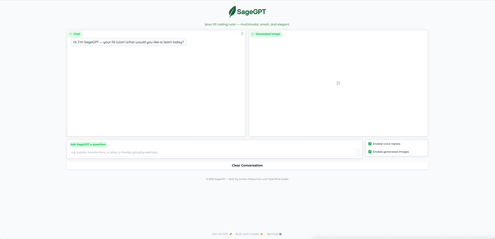
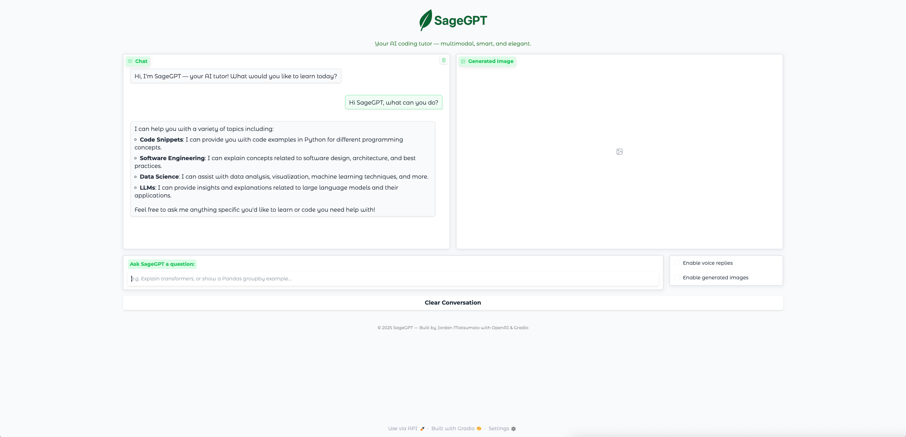
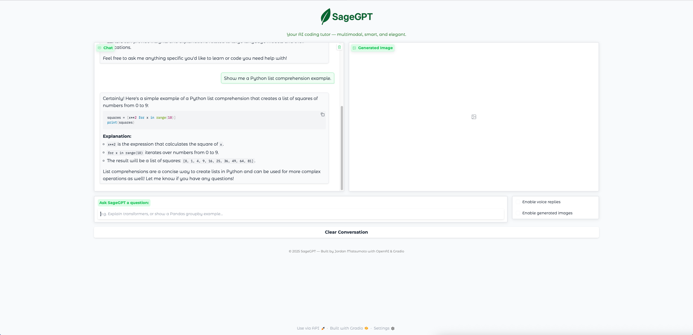
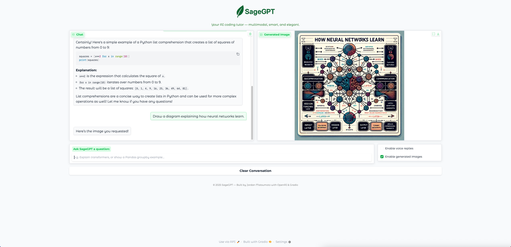
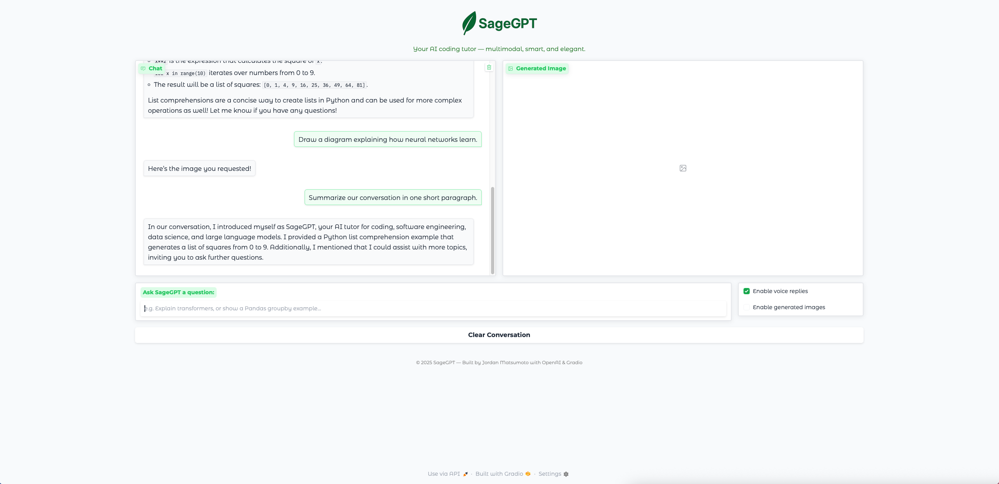

# SageGPT

This repository contains SageGPT, an intelligent, multimodal AI tutor built with Python, OpenAI’s GPT-4o-mini, and Gradio. SageGPT acts as a friendly technical tutor who answers questions about code, software engineering, data science, and LLMs by providing concise explanations, code examples, and optionally generating diagrams and spoken replies. It demonstrates multimodal AI capabilities, tool usage, and a clean, modern user interface design.

## Screenshots

  
*Chat with SageGPT through a clean and elegant Gradio interface with optional image and voice output.*

## Demo

### 1. Intro
**Prompt:**  
> Hi SageGPT, what can you do?

**Result:**  

*SageGPT explains its capabilities.*

### 2. Tool Call (Code Snippet Retrieval)
**Prompt:**  
> Show me a Python list comprehension example.

**Result:**  

*SageGPT provides a clear explanation with a code example.*

### 3. DALL·E Technical Diagram Generation
**Prompt:**  
> Draw a diagram explaining how neural networks learn.

**Result:**  

*Generates a technical diagram using DALL·E 3.*

### 4. TTS / Audio Response
**Prompt:**  
> Summarize our conversation in one short paragraph.

**Result:**  
[Listen to the TTS response](assets/audio/sagegpt_response.mp3)    

*SageGPT generates a spoken summary using TTS (voice: `onyx`).  
Audio plays automatically in-app or can be downloaded:*

## Project Overview

- **Genre:** AI Tutor / Multimodal Assistant  
- **Framework:** Gradio + OpenAI 
- **Objective:** Provide a clear, interactive, multimodal coding tutor  
- **Visuals:** Clean, modern UI with chat, diagram generation, and TTS playback  
- **Features:** Code snippets, diagram generation (DALL·E 3), text-to-speech (TTS), and conversational memory  

## Features

- **Technical Tutor Personality:** Trained with a system message to provide concise, educational answers about programming and AI.  
- **Code Snippet Tool:** Built-in tool for retrieving relevant Python snippets for quick learning.  
- **Toggleable Diagram Generation:** Generate clean, professional diagrams for explained topics with DALL·E 3 when the *Image* toggle is enabled.  
- **Toggleable Text-to-Speech:** Uses OpenAI’s `tts-1` model to speak SageGPT’s replies aloud when the *Voice* toggle is enabled.  
- **Multimodal Interaction:** Handles text, tool calls, images, and audio all in one interface.  
- **Elegant Gradio Interface:** Minimal design with themed UI, toggles for media, and a custom icon.  

## Controls

- **Ask SageGPT:** Type any coding or AI-related question into the input box.  
- **View Explanation:** Receive a clear text answer directly in the chat.  
- **Enable Image Generation:** Turn on “Enable generated images” to have SageGPT create technical diagrams for relevant topics.  
- **Enable Voice Replies:** Turn on “Enable voice replies” to hear spoken responses.  
- **Clear Chat:** Reset the conversation anytime.  

## How SageGPT Works

### Multimodal Chat Loop
  - Accepts user input from Gradio.  
  - Uses OpenAI’s GPT-4o-mini model to process text and tool calls.  
  - Executes custom tool calls (e.g., code snippet retrieval).  
  - Optionally triggers DALL·E 3 to generate a technical diagram if the *Image* toggle is on.  
  - Optionally converts the final response into speech using TTS if the *Voice* toggle is on.  
  - Displays text, image, and audio output in the interface based on user-selected options.  

### System Prompt Behavior
  - Guided by a system message defining SageGPT as a calm, knowledgeable tutor.  
  - Encourages concise answers and example-driven teaching style.  

### Tool Integration
  - `get_code_snippet()` retrieves short, predefined code snippets for core programming concepts.  
  - Integrated into OpenAI’s function calling*interface for dynamic behavior.  

### Technical Highlights
  - Combines GPT-4o-mini, DALL·E 3, and TTS models.  
  - Implements structured tool calling with JSON schema validation.  
  - Uses Gradio Blocks for responsive layout and clean styling.  
  - Plays audio via PyDub directly in the app.
    
## Installation

1. **Clone the repository**  
```bash
git clone https://github.com/jordanmatsumoto/sagegpt.git
```

2. **Change directory**
``` bash
cd sagegpt
```

3. **Install dependencies**
``` bash
pip install -r requirements.txt
```

4. **Set up your environment variables**  
Create a .env file in the project root and add your OpenAI API key:
``` bash
OPENAI_API_KEY=your_api_key_here
```

5. **Run the app**
``` bash
python sagegpt.py
```

6. **Open the Gradio interface**  
A local URL and optional public shareable URL will appear in the console.
